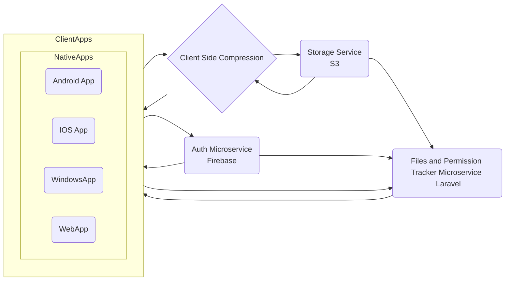

# Simple Drive System

```mermaid
flowchart LR

    subgraph ClientApps
        subgraph NativeApps
            AndroidApp(Android App)
            IOSApp(IOS App)
            WindowsApp(WindowsApp)
            WebApp(WebApp)
        end
    end

    CSS{Client Side Compression}
    AuthMicroservice(Auth Microservice <br/> Firebase)
    StorageService(Storage Service <br/> S3)

    FilesPermissionTrackerMicroservice(Files and Permission Tracker Microservice <br/> Laravel)

    CSS --> ClientApps
    ClientApps --> CSS
    CSS --> StorageService
    StorageService --> CSS
    StorageService --> FilesPermissionTrackerMicroservice

    AuthMicroservice --> ClientApps
    ClientApps --> AuthMicroservice
    AuthMicroservice -->FilesPermissionTrackerMicroservice
    FilesPermissionTrackerMicroservice --> ClientApps
    ClientApps --> FilesPermissionTrackerMicroservice
```
